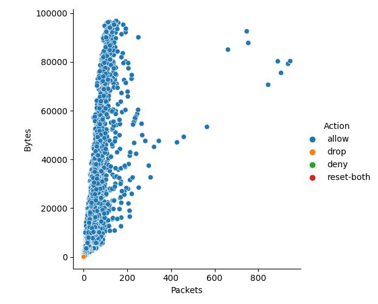
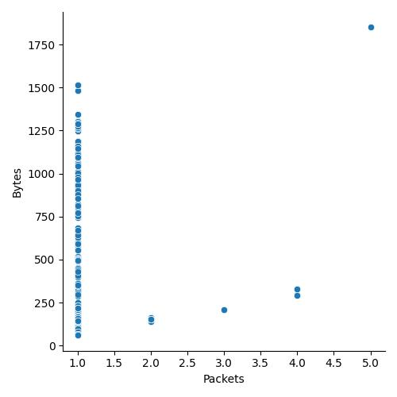

# Исследование набора данных `Firewall.csv`

## Подготовка среды для исследования

Необходимые зависимости для исследования описаны в файле [requirements.txt][requirements_file]

Для того, чтобы установить все необходимые зависимости, необходимо выполнить команду:
```bash
pip install -r requirements.txt
```

## Введение

Брандмауэр (от нем. `Brandmauer`, от `Brand` - "пожар", и `Mauer` - "стена") является важным элементом при обеспечении информационной безопасности в организации, т.к. обнаруживает и блокирует сетевой трафик на основе списков доступа или динамических правил.

В качестве набора данных был выбран файл [./data_sets/Firewall.csv][firewall_csv_file] (журнал брандмауэра).

Источник: [kaggle.com][kaggle_firewall]

## Исследование

Данные содержат информацию, разделенную на следующие столбцы:
* `Source Port` - порт источника;
* `Destination Port` - порт назначения;
* `NAT Source Port` - порт источника `NAT`;
* `NAT Destination Port` - порт назначения `NAT`;
* `Action` - действие (`allow`, `deny`, `drop`, `reset-both`);
* `Bytes` - количество байтой переданных по указанному соединению;
* `Bytes sent` - количество отправленных байтов;
* `Bytes Received` - количество принятых байтов;
* `Packets` - количество пакетов переданных по указанному соединению;
* `Elapsed Time (sec)` - время затраченное на передачу пакетов (в секундах);
* `pkts_sent` - количество отправленных пакетов;
* `pkts_received` - количество принятых пакетов.

Более подробная информация изложена в [файле исследования][research_notebook] в формате `.ipynb` (Jupyter Notebook)

## Построенные графики

В ходе исследования были построено два графика:

### Анализ всех записей


### Анализ записей, помеченных `deny`



## Заключение

В ходе анализа [журнала брандмауэра][firewall_logs] был проведен полный анализ данных и анализ данных помеченных `deny` (cтолбец `Action`)

<!-- Ссылки -->

[firewall_logs]: data_sets/Firewall.csv

[firewall_csv_file]: data_sets/Firewall.csv

[kaggle_firewall]: https://www.kaggle.com/datasets/sgd825344491/internet-firewall

[research_notebook]: research.ipynb

[requirements_file]: requirements.txt
